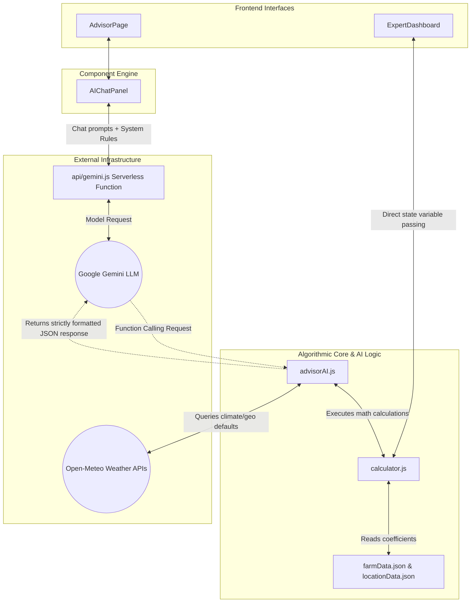
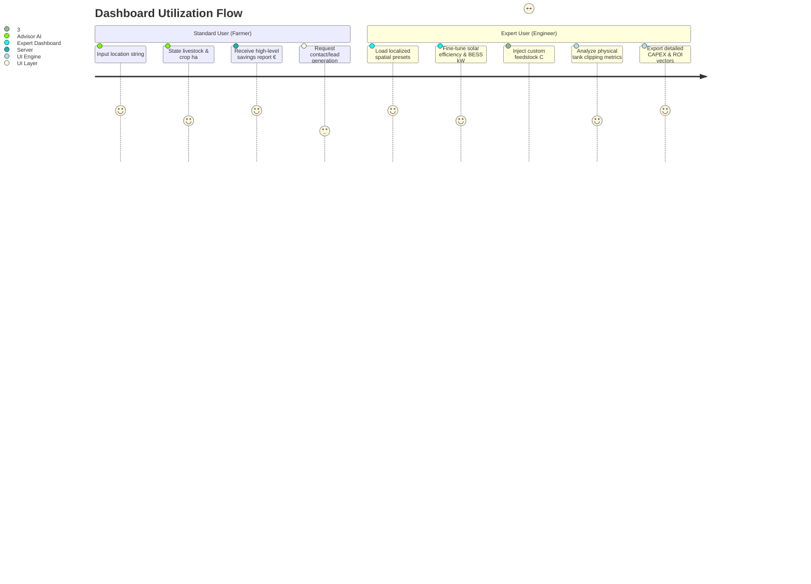

# Chapter X: Technical Architecture and System Mechanics of the VONeng Farm Management Platform

## 1. Project Architecture & Directory Structure

The VONeng Farm Management Platform is structured as a modern React application utilizing Vite for build tooling, Tailwind CSS for styling, and Firebase for authentication. However, the core identity of the platform relies heavily on mathematical modeling and AI integrations housed within specific utility and API layers. 

### 1.1 Directory Map

| Path | Type | Structural Purpose & Contents |
| :--- | :--- | :--- |
| `/` (Root) | Configuration | Contains the fundamental setup vectors: `package.json` (dependencies like React, Recharts, Firebase, Google GenAI), `vite.config.js` (bundler), and configuration files for Tailwind/PostCSS. |
| `/farmData.json` | Core Database | A static JSON file acting as the primary biological and physical engine database. It houses coefficients for biogas yields, parasitic loads, grid CO₂ intensities, and digestate values. |
| `/locationData.json` | Core Database | A pre-compiled spatial database mapping global climatic zones. It correlates specific regions with average solar irradiance ($kWh/m^2/day$), winter ambient temperatures, and default crop matrices. |
| `/api/gemini.js` | Serverless Function | Acts as the proxy interface and secure wrapper bridging the client-side frontend code and the external Google Gemini API, ensuring `GEMINI_API_KEY` protection. |
| `/src/pages/` | Frontend Subsystem | The view layer housing the platform's primary entry nodes: `ExpertDashboard.jsx` (data-dense control center), `AdvisorPage.jsx` (conversational AI interface for farmers), and `DashboardPage.jsx` (routing controller). |
| `/src/components/` | Modular UI Elements | Encapsulated React components. Key files include `AIChatPanel.jsx` (the conversational UI shell), `KPICards.jsx`, `Charts.jsx`, `DigestateCard.jsx`, and `RevenueStack.jsx`. |
| `/src/utils/` | Algorithmic Core | The mathematical and logical heart of the system. `calculator.js` handles all kinematic, thermodynamic, and financial formulas. `advisorAI.js` constructs the integration parameters, tools, and reasoning logic for the LLM. |

### 1.2 Subsystem Analysis
The separation of concerns is meticulously maintained. The algorithmic rules (`calculator.js`) are entirely decoupled from the view logic (`ExpertDashboard.jsx`). This allows the LLM (`advisorAI.js`) to import and execute the identical mathematical functions utilized by the deterministic UI. Consequently, there is zero divergence between an answer generated by the AI and an answer derived from manual slider manipulation on the expert interface.

---

## 2. System Connectivity & Data Flow

Data propagation through the system operates in two distinct life cycles depending on user access tier: Deterministic (Expert) and Probabilistic (Standard Farmer).

**Deterministic Lifecycle**: The Expert User manipulates state parameters in `/pages/ExpertDashboard.jsx`. These parameters immediately flow into `calculator.js`. The resulting matrices (Energy, Carbon, Financial) are piped synchronously back up to the UI components (e.g., `Charts.jsx`, `KPICards.jsx`).

**Probabilistic Lifecycle**: Unstructured natural language from a standard user enters the `AIChatPanel.jsx`. This forwards the string array to the `/api/gemini.js` endpoint alongside the rigid schemas provided by `advisorAI.js`. Gemini processes the text, invokes internal mathematical tools, routes back through the proxy, runs the deterministic `calculator.js` locally, and formats a human-readable response.

---

## 3. API Integration Layer

The platform relies on two primary external data streams to facilitate intelligent decision-making and spatial awareness.

### 3.1 Google Generative AI (Gemini 2.5 Flash)
- **Role**: Operates as the cognitive routing layer and natural language interface.
- **Connection**: Requests flow outward via the `fetch` API enclosed within `api/gemini.js`.
- **Mechanics**: Gemini does not calculate math. It acts as an orchestrator. It receives a strictly defined schema of allowed functions (`calculate_with_voneng`, `calculate_farm_baseline`). When a farmer types, *"I have 50 cows in Madrid"*, Gemini extracts the integers and spatial strings, halts its generation, issues a function call request back to the client, waits for `advisorAI.js` to execute the local Javascript calculations, ingests the resulting JSON object (comprising actual savings metrics), and formulates its final translation payload.

### 3.2 Open-Meteo Geocoding & Historical Weather APIs
- **Role**: Dynamic fallback spatial engine to circumvent hard-coded limitations.
- **Connection**: Accessed directly via generic REST `fetch` inside `advisorAI.js` (`findLocation` function).
- **Mechanics**: If a user specifies an unrecognized global rural location, the system queries the `geocoding-api` to retrieve latitude and longitude. It then recursively pings the `archive-api` pulling 365 days of trailing historical weather data (specifically filtering for `temperature_2m_min`, `precipitation_sum`, and `shortwave_radiation_sum`).
- **Data Transformation**: Shortwave radiation is returned natively in $MJ/m^2$. The algorithmic core intercepts this vector and applies a strict scalar transformation ($\div 3.6$) to yield $kWh/m^2$, marrying the meteorological data with the platform's standard electrical framework.

---

## 4. AI Integration Mechanics

The AI layer within `advisorAI.js` is structurally robust to prevent hallucinations regarding financial and engineering metrics. This is achieved via a strict **Tool Definition Paradigm**.

### 4.1 Orchestration and Priming
The logic is initially primed with an exhaustive `SYSTEM_PROMPT`. This prompt defines the persona ("VONeng Farm Energy Advisor"), enforces strict linguistic adhesion policies, defines the hardware mechanics of the container, and restricts the topology of the outputs.

### 4.2 Parameter Extraction and The Climate Override Mechanic
When `advisorAI` initiates a `lookup_location` tool call, the AI attempts to match the entity against the local JSON. If it fails, the Open-Meteo live API is queried. 

Should both fail (an absolute edge-case), the AI receives a structural instruction: *`"LOCATION_NOT_FOUND... You MUST use your own internal AI knowledge to estimate the climate data... pass your estimates into the climate_override object."`*

This is a sophisticated fail-safe. Instead of apologizing to the user, the LLM hallucinates *climate scalars* (e.g., an estimated solar irradiance of 5.5 for a remote sub-Saharan region), passes these simulated physics back into the deterministic mathematical engine, and generates an approximate but technically grounded report.

---

## 5. Core Engine: Calculators & Dashboards

### 5.1 Thermodynamic & Spatial Calculators
The `calculator.js` file houses the mathematical baseline of the system. 

**Biogas Production Rate**: 
Annual biogas potential ($V_{biogas}$) is unconstrained and derived by summing livestock populations multiplied by their daily manure yields and biogas conversion efficiencies [1].
$$ V_{biogas} = \left( \sum_{i \in \{cows, pigs, chickens\}} N_i \times M_{daily, i} \times Y_{biogas, i} \right) \times 365 $$

**Hydraulic Target & Physical Digester Constraints**:
The required sizing of an anaerobic digester relies heavily on the assumed Hydraulic Retention Time ($HRT$ = 30 days) [2].
$$ V_{req} = \left( \frac{V_{biogas}}{365} \right) \times HRT $$

However, standard VONeng container geometry institutes a hard volumetric limit constraint of $120m^3$.
$$ V_{actual} = \min(V_{req}, 120) $$

**Energy Yield Translation**:
To extract theoretical kilowatt-hours ($E_{biogas}$) from volumetric biogas, the system integrates the raw volume with gaseous energy density ($\rho$) and nominal generation efficiency ($\eta_{gen}$) [3].
$$ E_{biogas} = V_{biogas} \times \rho_{biogas} \times \eta_{gen} $$

**Parasitic Load Penalty Factor ($P_{loss}$)**:
Anaerobic digestion relies on mesophilic bacterial reactions which stall below ambient thresholds (specifically engineered to fault at $<5^\circ C$). The system applies a dynamic deductive fraction when local climate vectors indicate extreme cold.
$$ E_{net\_biogas} = E_{biogas} \times (1 - P_{loss}) $$

**Photovoltaic Yield**:
Solar energy ($E_{solar}$) integrates panel area ($A_{pv}$), irradiance ($I_{solar}$), an assumed efficiency coefficient ($\eta_{pv}$):
$$ E_{solar} = A_{pv} \times I_{solar} \times \eta_{pv} \times 365 $$

### 5.2 User Interface Dichotomy: Standard vs. Expert

**Standard Dashboard (AdvisorPage)**
Designed for zero-friction cognitive loading. The UI is a conversational thread hiding all internal variables. Data I/O revolves solely around rudimentary physical metrics: "Where are you?", "How many cows do you own?". Real-world implications are aggregated into high-level vectors: "Total Yearly Benefit" or "Estimated CO₂ Avoided." 

**Expert Dashboard**
Built for project financiers and environmental engineers. Data I/O is explicitly multidimensional, granting granular control over 18 floating parameters (e.g., C:N ratio monitoring, manual climate overrides, parasitic deduction curves, export limits to the grid, and grid carbon densities).

Key divergence: The expert dashboard allows the user to witness clipping constraints directly—such as when a massive influx of potential feedstock exceeds the $120m^3$ ceiling, artificially capping the available digestate yield.

---

## 6. Assumptions Matrix

The platform model must lock certain physical and financial behaviors to extrapolate complex ROI over long durations.

| Category | Assumption | Justification | Impact on System Operation |
| :--- | :--- | :--- | :--- |
| **Engineering** | HRT strictly set to 30 days | Accounts for mesophilic digestion speeds required to stabilize common agricultural substrates [4]. | Dictates volumetric throughput capacity. Longer HRT limits processing mass. |
| **Engineering** | 10% Volumetric Headspace Reserve | Digesters require expansion volume for gas accumulation prior to extraction. | Net effective tank capacity drops from 120$m^3$ to 108$m^3$. |
| **Engineering** | PV Panel Efficiency ($\eta_{pv}$) = 20% | Commercial monocrystalline silicon panel average benchmark [5]. | Determines the requisite square spatial footprint to generate baseline electrical offset. |
| **Financial** | Base CAPEX = $40,000 | Baseline cost analysis of a modular 120$m^3$ collapsible digester with a 15kW micro-CHP generation stack. | Directly skews the ROI payback horizon outputs on the Expert Dashboard. |
| **Financial** | BESS Ratio = 1:3 ($kW_p : kWh$) | Establishes total energy independence buffering for standard nocturnal agricultural operations. | High capital expenditure penalty placed on the system sizing logic, elevating projected infrastructure costs. |
| **Software** | Open-Meteo utilizes TTM 2023 | Trailing twelve-month weather acts as an adequate substitute for 10-year climatic averages. | Edge cases (such as anomalous drought years) will permanently pollute the baseline algorithm calculations for a queried zone. |

---

## 7. System Constraints & Limitations

The intersection of physical thermodynamics and software modeling guarantees specific limitations across the product topography.

**Volumetric Boundary Conditions (Mechanical Limit)**
The platform models a *containerized* solution. It is physically bound by standard logistical parameters. Consequently, regardless of biological influx capacity (e.g., a farm featuring 500 cows), the theoretical modeling strictly limits digestate output variables against the maximum $120m^3$ volume. The software caps potential yield linearly against the physical walls of the reactor.

**Geographical Penalty Algorithms (Thermodynamic Limit)**
The system intentionally chokes power metrics in specific cold-climate deployments. Digesters must maintain mesophilic temperatures (~$37^\circ C$). If the queried `winter_temperature_min_c` falls below $5^\circ C$, the system forcibly diverts a parasitic load fraction of generated biogas back into heating, rendering that energy inaccessible for financial offsetting.

**Data Staleness and Oracle Fallibility (Software Limit)**
Energy ecosystems are highly volatile. A limitation exists via the static `farmData.json` mappings for localized `grid_co2_kg_per_kwh` and `electricity_price_eur`. While acceptable for thesis-level approximations, real-world deployment necessitates a live oracle integration for hourly spot pricing to validate high-precision macroeconomic financial modeling. 

---
*Placeholder References:*
* [1] [Academic Citation regarding standard dairy cow daily methane emissions].
* [2] [Academic Citation regarding anaerobic digestion HRT requirements].
* [3] [Academic Citation regarding physical properties and energy density of raw biogas].
* [4] [Academic Citation regarding mesophilic temperature ranges].
* [5] [Academic Citation referencing commercial photovoltaic module STC efficiencies].
