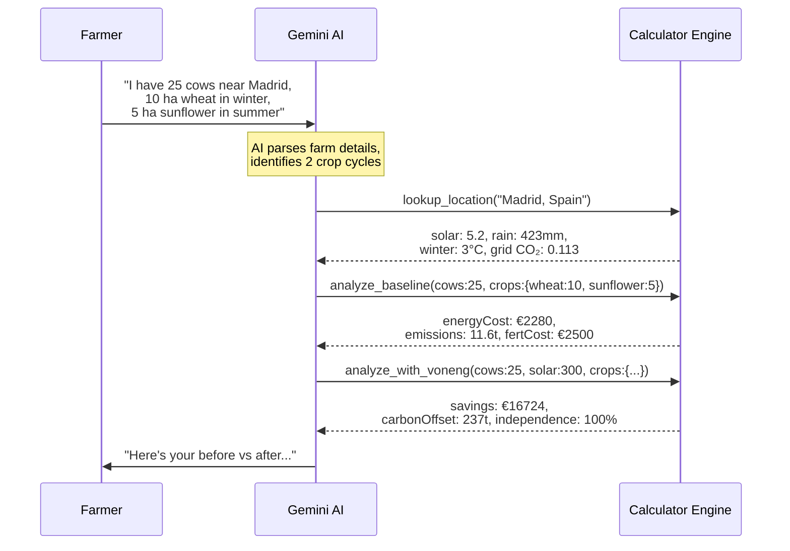
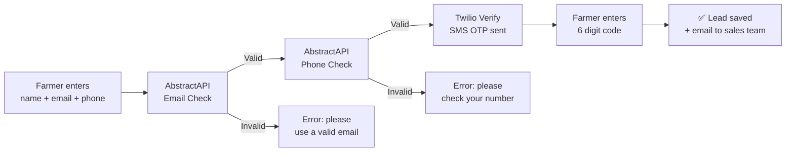
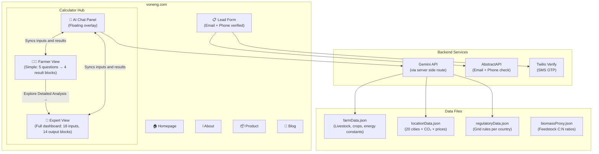

# VONeng AI Farm Advisor — Final Proposal

---

## 1. Executive Summary

VONeng needs a digital product that lets any farmer, in any language, describe their farm in a few sentences and instantly see how much money they are losing today on energy and fertilizer — and how much they would save with a VONeng container system.

This proposal covers:

1. **Two Mode Dashboard** — A simplified Farmer View (default) and a detailed Expert View (opt in)
2. **AI Farm Advisor** — A conversational chatbot powered by Gemini that acts as a virtual energy consultant
3. **Full Company Website** — A complete voneng.com with the calculator and AI embedded
4. **Multilingual Support** — English, Spanish, Hindi, and French from day one
5. **Lead Capture** — Verified email and phone collection after the AI conversation
6. **Scientific Accuracy Fixes** — Three critical corrections to the calculator engine
7. **Regulatory Awareness** — Country specific grid export rules and feed in tariff data

**Timeline:** 7 to 9 days for MVP, 17 to 21 days for the full product
**Running cost:** €0 to €15 per month at early stage

---

## 2. The Problem with the Current Dashboard

The existing EcoSynergy dashboard is an excellent engineering tool, but it was built for engineers, not farmers. Here is what a non technical farmer encounters:

### Too Many Inputs (18 Fields)

| What the sidebar asks | What the farmer thinks |
|---|---|
| Solar Array (m²) | *"How many panels is that? I just have some roof space."* |
| Inverter (kW) | *"What is an inverter?"* |
| Export Limit (kW) | *"Export what? To where?"* |
| Rain Depth (mm) | *"I have no idea how much rain falls in millimeters"* |
| Feedstock: Dry/Straw (%) | *"What is a feedstock percentage?"* |
| C:N ratio warning | *"I am a farmer, not a chemist"* |

### Too Many Outputs (14 Information Blocks)

The main area shows 4 charts, 3 KPI cards, 4 insight cards, 2 warning notes, 1 banner, and a collapsible assumptions panel. A farmer visiting for the first time sees all 14 blocks and cannot determine which numbers matter to them.

### No Narrative

The dashboard shows **data** but never tells a **story**. It never says: *"Right now you are spending €5,600 per year. With VONeng you would save €16,700 per year."* It expects the farmer to extract that conclusion themselves.

### No Conversion Path

After reviewing the dashboard, the farmer encounters a "Save Baseline" button. There is no "Get a Quote," no "Talk to an Advisor," no way to take the next step.

---

## 3. The Solution: Two Mode Architecture

### Mode 1 — Farmer View (Simple, Default)

This is what every farmer sees when they first arrive. It is the AI chatbot combined with a clean one page results summary.

#### What They Input (5 Questions)

The farmer answers these through conversation with the AI or via simple form fields:

| # | Question | Why We Ask | Example Answer |
|---|---|---|---|
| 1 | **Where is your farm?** | Determines solar irradiance, rainfall, grid regulations, electricity prices, grid CO₂ intensity | *"Near Madrid"* or select from dropdown |
| 2 | **What animals do you have?** | Drives biogas potential, manure volume, methane baseline | *"25 cows and 10 pigs"* |
| 3 | **What crops do you grow, and how many crop cycles per year?** | Drives carbon sequestration (biochar), water needs, energy needs for processing, and crop waste available for biogas feedstock | *"Wheat in winter, sunflower in summer — two cycles"* |
| 4 | **How much land do you farm?** | Hectares per crop, used for carbon and water calculations | *"10 hectares wheat, 5 hectares sunflower"* |
| 5 | **Do you have roof space or open land for solar panels?** | Drives solar energy potential and rainwater harvesting | *"My barn roof is about 400 m², and I have some open land too"* |

> [!IMPORTANT]
> **Question 3 (crop cycles) is essential.** A farm with two crop cycles per year (e.g., wheat in winter + sunflower in summer) produces twice the crop residue, which means more feedstock for biogas AND more biochar for carbon sequestration. The calculator already models 3 seasons with rotation — the AI just needs to collect this naturally.

#### What They See (4 Blocks Only)

After the AI collects the farm details, the Farmer View shows exactly 4 sections:

```
┌──────────────────────────────────────────────────────────────┐
│                                                              │
│  💸  YOUR FARM TODAY                                         │
│                                                              │
│  You currently spend approximately:                          │
│                                                              │
│     ⚡ €2,280/year on electricity (all from the grid)        │
│     🧪 €2,500/year on chemical fertilizer                    │
│     💧 €830/year on water pumping                            │
│     ──────────────────────────────────────────                │
│     📊 Total: €5,610/year                                    │
│                                                              │
│  Your farm emits approximately 11.6 tons of CO₂ per year    │
│  from grid electricity and unmanaged manure.                 │
│                                                              │
└──────────────────────────────────────────────────────────────┘

┌──────────────────────────────────────────────────────────────┐
│                                                              │
│  🟢  WITH VONENG                                             │
│                                                              │
│  Annual savings on electricity:      €2,280                  │
│  Annual savings on fertilizer:       €3,212                  │
│  (digestate replaces chemical fertilizer)                    │
│  Annual savings on water:            €488                    │
│  Potential carbon credit revenue:    €11,232                 │
│  ──────────────────────────────────────────                   │
│  💰 Total annual value: €16,724/year                         │
│                                                              │
│  🌍 Your farm becomes CARBON NEGATIVE                        │
│     (offsetting 237 tons CO₂e per year)                      │
│                                                              │
│  ⚡ 100% energy independent — no more electricity bills      │
│                                                              │
└──────────────────────────────────────────────────────────────┘

┌──────────────────────────────────────────────────────────────┐
│                                                              │
│  📦  WHAT WE INSTALL                                         │
│                                                              │
│  A single shipping container with:                           │
│  • Solar panels sized for your farm                          │
│  • Roll out biogas digester for your 25 cows                 │
│  • CHP engine (electricity + heat from biogas)               │
│  • Battery storage (power 24/7)                              │
│  • Smart control center                                      │
│                                                              │
│  🔗 Learn more about the product →                           │
│                                                              │
└──────────────────────────────────────────────────────────────┘

┌──────────────────────────────────────────────────────────────┐
│                                                              │
│  📞  INTERESTED? LET'S TALK                                  │
│                                                              │
│  [  Your name              ]                                 │
│  [  Email (verified)       ]                                 │
│  [  Phone (verified + OTP) ]                                 │
│  [  Message (optional)     ]                                 │
│                                                              │
│  [    SEND MY DETAILS    ]                                   │
│                                                              │
│  Your farm profile will be shared with our                   │
│  team so we can prepare a personalized proposal.             │
│                                                              │
└──────────────────────────────────────────────────────────────┘
```

**What is deliberately excluded from Farmer View:**
- No investment/payback section (investment strategy with corporate co funding and government subsidies is still being designed)
- No inverter or export limit controls
- No feedstock recipe percentages or C:N ratios
- No parasitic load warnings
- No donut charts or bar charts
- No technical jargon

**Why no investment section?**
The investment model depends on how much comes from corporate partners, government subsidies, and the farmer's own contribution. Until that strategy is finalized, showing a payback period could be misleading. For now, the farmer sees only savings — which is the most compelling part of the story.

### Mode 2 — Expert View (Detailed, Opt In)

An *"Explore Detailed Analysis →"* link at the bottom of Farmer View opens the current full dashboard with all controls and charts.

| Feature | Farmer View | Expert View |
|---|---|---|
| Inputs | 5 questions (via chat or simple form) | Full sidebar with 18 fields |
| Outputs | 4 clean blocks (Today / With VONeng / What we install / Contact) | 14 blocks: KPIs, charts, digestate, revenue stack, warnings |
| Jargon | Zero | Technical terms permitted (parasitic load, C:N, inverter clipping) |
| Charts | None | 4 Recharts visualizations |
| Target user | Farmers | Engineers, investors, sales team |
| Language | Conversational, narrative | Data driven, analytical |
| Investment details | Excluded (TBD) | Can be added later when strategy is finalized |

---

## 4. The AI Farm Advisor

### What It Is

A conversational AI chatbot embedded as a floating panel in the dashboard. Powered by Google's Gemini API with function calling — meaning the AI can actually **run your real calculator functions** and report the exact results.

### How It Works



### Crop Cycle Handling

When the farmer mentions multiple crop cycles, the AI maps them to seasons:

```
👨‍🌾 "I grow wheat from October to March, then sunflower 
    from April to August. About 10 hectares total."

🤖 Got it! I see you have two crop cycles per year:

   🌾 Cycle 1 (Oct–Mar): Wheat on ~10 hectares
       → Straw residue: 4.0 tons/ha = 40 tons total
       → Great feedstock for your biogas digester!
       
   🌻 Cycle 2 (Apr–Aug): Sunflower on ~10 hectares
       → Residue: 3.0 tons/ha = 30 tons total
       → Additional biogas feedstock
   
   With two cycles, you produce 70 tons of crop residue 
   per year — that's 21 tons of biochar, sequestering 
   52.5 tons of CO₂ annually!
   
   Plus all that crop waste can supplement your cow manure 
   in the biogas digester for even more energy.
```

### Example Conversations

````carousel
**Scenario 1: Complete Farm Assessment**
```
👨‍🌾 "I have 25 dairy cows and about 10 hectares.
    I grow wheat in winter and corn in summer. 
    My barn roof is maybe 400 square meters.
    I'm near Madrid."

🤖 Great! Let me analyze your farm:

📍 Madrid, Spain
🐄 25 dairy cows
🌾 10 ha wheat (winter) + 10 ha corn (summer)
🏠 400 m² roof space

📊 YOUR FARM TODAY:
   Electricity bill: ~€2,280/year
   Chemical fertilizer: ~€2,500/year  
   Water costs: ~€830/year
   CO₂ emissions: 11.6 tons/year
   Total annual cost: €5,610/year

🟢 WITH VONENG:
   Electricity savings: €2,280/year
   Fertilizer savings: €3,212/year
   Water savings: €488/year
   Carbon credit potential: €11,232/year
   
   💰 Total annual value: €16,724/year
   🌍 Carbon negative: offsetting 237 tons CO₂/year
   
Would you like to know more about any of these numbers?
```
<!-- slide -->
**Scenario 2: In Spanish**
```
👨‍🌾 "Tengo 15 vacas y 8 hectáreas de trigo 
    cerca de Barcelona"

🤖 ¡Perfecto! He analizado tu granja:

📍 Barcelona, España (5.0 kWh/m²/día solar)
🐄 15 vacas lecheras
🌾 8 hectáreas de trigo

📊 TU GRANJA HOY:
   Electricidad: ~€1,850/año
   Fertilizante químico: ~€2,000/año
   Total costes anuales: ~€4,470/año
   Emisiones: 8.3 toneladas CO₂/año

🟢 CON VONENG:
   Ahorro en electricidad: €1,850/año
   Ahorro en fertilizante: €2,570/año
   Potencial créditos de carbono: €8,940/año
   
   💰 Valor total anual: €13,360/año
   🌍 Tu granja se vuelve carbono negativa
   
¿Te gustaría saber más detalles?
```
<!-- slide -->
**Scenario 3: In Hindi**
```
👨‍🌾 "मेरे पास 20 गाय हैं और 5 हेक्टेयर गेहूं है"

🤖 बहुत अच्छा! आइए आपके खेत का विश्लेषण करें:

🐄 20 दुधारू गाय
🌾 5 हेक्टेयर गेहूं

📊 आपका खेत आज:
   बिजली का खर्च: ~₹2,10,000/साल
   रासायनिक खाद: ~₹1,50,000/साल
   कुल वार्षिक खर्च: ~₹3,60,000/साल
   CO₂ उत्सर्जन: 9.2 टन/साल

🟢 VONeng के साथ:
   बिजली की बचत: ₹2,10,000/साल
   खाद की बचत: ₹2,45,000/साल
   
   💰 कुल वार्षिक लाभ: ₹12,50,000/साल
   🌍 कार्बन नकारात्मक खेत

क्या आप और जानना चाहेंगे?
```
<!-- slide -->
**Scenario 4: Grid Regulations**
```
👨‍🌾 "Can I sell extra electricity in Germany?"

🤖 Yes! In Germany, under the EEG:

   Your biogas plant (under 75 kW):
   Feed in tariff: €0.09 to €0.15/kWh
   Flexibility bonus: €100/kW (raised Jan 2025)
   
   Your solar installation:
   Subject to auction based tariffs
   Self consumption is most profitable
   
   ⚠️ Grid connection needs approval from your 
   local Netzbetreiber (grid operator).
   
   Processing time: typically 4 to 8 weeks.
   
   Note: These are reference figures. Please 
   confirm with your local energy regulator.
```
````

### What the AI Will NOT Do

| Out of Scope | Why |
|---|---|
| ❌ Control actual hardware | That is the Container Brain — a separate system |
| ❌ Connect to live sensors | This is a modeling and planning tool, not operational |
| ❌ Guarantee exact figures | Disclaimer: "These are expert estimates, not guarantees" |
| ❌ Show investment or payback | Investment strategy (corporate + subsidy + farmer share) is still being finalized |
| ❌ Replace a site survey | The AI qualifies the lead; a real engineer validates before installation |
| ❌ Scope 3 corporate reporting | That is the Corporate Data Hub — a separate product |

---

## 5. Full Company Website

The calculator and AI agent should live inside a proper company website, not as a standalone app.

### Proposed Site Structure

| Page | Purpose | Key Content |
|---|---|---|
| **Homepage** | First impression, value proposition | Hero section, 3 step process, testimonials, CTA |
| **About** | Company story, team, mission | Founding story, team photos, mission statement |
| **Product** | The VONeng container explained | What is inside the box, how it works, components, photos |
| **Calculator + AI** | The farm assessment tool | Farmer View (default) with AI chat + link to Expert View |
| **Blog / Resources** | Thought leadership | Case studies, EU regulation guides, sustainability articles |
| **Contact** | Lead capture | Verified email + phone form, office address, map |

### Tech Stack

| Layer | Technology | Purpose |
|---|---|---|
| Framework | Next.js 14 (or Vite with routing) | SEO, server rendering, API routes |
| Styling | Tailwind CSS (already in use) | Consistent design language |
| Charts | Recharts (already in use) | Expert View charts |
| AI | Gemini API via server side API route | Keeps API key secure |
| i18n | react-i18next | Website UI translations |
| Verification | AbstractAPI + Twilio Verify | Email and phone validation |
| Forms | React Hook Form + Zod | Clean form handling |
| Hosting | Vercel (already in use) | Zero config deploys |

---

## 6. Multilingual Support

### Two Levels of Translation

| Level | What | How | Effort |
|---|---|---|---|
| **AI Chat Responses** | Everything the AI says to the farmer | Gemini natively speaks 100+ languages. Zero extra work. | **Instant** |
| **Website UI** | Menus, sidebar labels, chart titles, buttons, footer | react-i18next with 4 translation JSON files (EN, ES, HI, FR) | **4 to 5 days** |

### Language Specific Considerations

| Language | Script | Currency | Number Format | Font Needed |
|---|---|---|---|---|
| English | Latin | € or $ (by location) | 1,234,567 | Default (Inter) |
| Spanish | Latin | € | 1.234.567 | Default (Inter) |
| Hindi | Devanagari | ₹ (INR) | 12,34,567 (Indian system) | Noto Sans Devanagari (Google Fonts, free) |
| French | Latin | € | 1 234 567 (space separator) | Default (Inter) |

### How It Works

A language switcher in the website header lets the user choose. The browser language is auto detected on first visit.

For Hindi:
- Devanagari script renders correctly with Google Fonts
- Number formatting uses the Indian lakh/crore system (12,34,567 instead of 1,234,567)
- Currency shows ₹ instead of € when the context is Indian
- No RTL support needed (Hindi is left to right)

---

## 7. Scientific Accuracy Audit

Every constant in the calculator has been verified against peer reviewed literature.

### Constants That Are Scientifically Sound (13 of 16)

| Constant | Your Value | Scientific Range | Source |
|---|---|---|---|
| Dairy cow daily manure | 60 kg/day | 27 to 102 kg/day, avg ~64 | Ohio State University, FAO |
| Cow biogas yield | 0.04 m³/kg | 0.03 to 0.05 m³/kg fresh manure | IEA 2020, ResearchGate |
| Pig daily manure | 5 kg/day | 4 to 7 kg/day | IPCC 2006 Guidelines |
| Pig biogas yield | 0.06 m³/kg | 0.04 to 0.08 m³/kg | IEA 2020 |
| Chicken daily manure | 0.15 kg/day | 0.10 to 0.18 kg/day | USDA ARS 2018 |
| Chicken biogas yield | 0.10 m³/kg | 0.08 to 0.12 m³/kg | IEA 2020 |
| Biogas energy density | 6.0 kWh/m³ | 5.0 to 7.0 kWh/Nm³ | World Biogas Association |
| CHP generator efficiency | 35% | 35 to 43% electrical | Clarke Energy, scientific literature |
| Roof runoff coefficient | 0.85 | 0.80 to 0.95 | ASCE 2015 |
| Biochar conversion rate | 0.30 | 0.25 to 0.35 | International Biochar Initiative 2020 |
| CO₂ per ton biochar | 2.5 tons | 2.0 to 3.0 tons | Lehmann & Joseph 2015 |
| Parasitic load range | 20 to 30% | 15 to 35% | European Biogas Association |
| Parasitic load threshold | 5°C | Typical 5 to 10°C ambient | European Biogas Association |

### Constants That Need Fixing (3 of 16)

> [!CAUTION]
> Fix #1 is critical. Using a single CO₂ intensity value for all 20 locations is the biggest accuracy problem in the calculator.

**Fix #1: Grid CO₂ intensity must be per country (CRITICAL)**

| Location | Your Value | Actual 2025 Value | Error |
|---|---|---|---|
| Norway | 0.40 kg/kWh | **0.017** kg/kWh | Overstates carbon savings by 23× |
| Spain | 0.40 kg/kWh | **0.113** kg/kWh | Overstates by 3.5× |
| Germany | 0.40 kg/kWh | **0.335** kg/kWh | Close but still 20% off |
| Poland | 0.40 kg/kWh | **0.618** kg/kWh | Understates by 35% |
| EU Average 2024 | 0.40 kg/kWh | **0.213** kg/kWh | Overstates by 88% |

**Solution:** Add `grid_co2_intensity_kg_per_kwh` to each entry in [locationData.json](file:///Users/aniruddhshastri/Farm_Management/locationData.json) with the real 2025 value.

**Fix #2: Electricity prices must be per country (IMPORTANT)**

| Location | Your Value | Actual 2025 Value |
|---|---|---|
| All locations | $0.15/kWh | Germany: €0.28, France: €0.20, Spain: €0.18, Norway: €0.08 |

**Solution:** Add `electricity_price_eur_per_kwh` and `export_price_eur_per_kwh` to each location.

**Fix #3: Solar formula needs panel efficiency (IMPORTANT)**

The current formula treats 1 m² of solar panel as capturing 100% of solar irradiance. Real panels have 18 to 22% efficiency.

```
Current:  solarArea × irradiance × 365
Fixed:    solarArea × irradiance × 0.20 × 365
```

This correction brings solar energy estimates in line with real world output.

---

## 8. Grid Regulations by Country

The AI advisor will reference country specific regulations when farmers ask about selling surplus power.

### Key Markets (2025 Data)

| Country | Export Scheme | Typical Export Rate | Key Rules |
|---|---|---|---|
| **Germany** | EEG Feed in Tariff + Flexibility Bonus | Biogas <75kW: €0.09 to €0.15/kWh | Flexibility bonus €100/kW. 1,300 MW biogas tenders in 2025 |
| **France** | EDF Obligation d'Achat (FiT) | Solar <9kW: €0.20/kWh. 9 to 100kW: €0.14/kWh | 20 year contracts. Rates adjusted quarterly |
| **Spain** | Net metering + surplus compensation | Market rate ~€0.05 to €0.08/kWh | Self consumption prioritized. "Sun tax" abolished 2018 |
| **Italy** | FER X Decree (Feb 2025) | Direct access for plants <1MW | Up to 40% grants for small enterprises. Tax credits up to 150% |
| **Netherlands** | Net metering (until Jan 2027) | 1:1 offset of consumption | Net metering ends 2027. After: ~€0.05 to €0.10/kWh |
| **Ireland** | SSRH + Biomethane Strategy | Operational tariff for biogas CHP | Pilot scheme for 15 farm scale biogas plants |
| **Nordics** | Certificate systems + net metering | Green certificate value + spot price | Cold climate (parasitic load 20 to 30%) |
| **Greece/Portugal** | Net metering + FiT | Self consumption model | High solar (5.5 to 5.8 kWh/m²/day) |

This data will live in a `regulatoryData.json` file that the AI queries via function calling.

> [!NOTE]
> The AI will always disclaim: *"Regulatory information is for guidance only. Actual tariffs and connection requirements must be confirmed with your local grid operator and energy regulator."*

---

## 9. Lead Capture with Verification

### Flow After AI Conversation

When a farmer sees their savings and wants to proceed:



### Services and Costs

| Service | Free Tier | Paid |
|---|---|---|
| **AbstractAPI Email Validation** | 100 checks/month | €14/month for 5,000 |
| **AbstractAPI Phone Validation** | 250 checks/month | €14/month for 5,000 |
| **Twilio Verify (SMS OTP)** | Trial credits | €0.05 per verification |
| **Total at early stage** | **€0/month** | |

---

## 10. Gemini API: Subscription vs API

### Your Question: "I have a Gemini Pro subscription — is the API free?"

**Answer: No.** They are separate products.

| Product | What It Is | Cost |
|---|---|---|
| **Google One AI Premium** (your subscription) | Consumer product: Gemini in Gmail, Docs, Chrome | ~$20/month |
| **Gemini API** (what we need) | Developer product: programmatic access for your app | Separate billing through Google Cloud |

### API Pricing (What We Actually Pay)

| Tier | Cost | Capacity |
|---|---|---|
| **Gemini 2.0 Flash — Free Tier** | **€0/month** | 15 requests/minute, 1M tokens/day. Handles ~50,000 conversations/day |
| **Gemini 2.0 Flash — Pay as you go** | ~€0.10 per 1M input tokens | Essentially free at startup volumes |
| **Gemini 1.5 Pro — Pay as you go** | ~€1.25 per 1M input tokens | Higher quality, 12× more expensive. Only if needed at scale |

**Recommendation:** Use **Gemini 2.0 Flash free tier**. A typical farmer conversation uses ~20,000 tokens total. The free tier handles this trivially. Upgrade to 1.5 Pro only if response quality becomes an issue at scale.

---

## 11. Architecture Overview



---

## 12. Development Timeline

| Phase | Scope | Time | Priority |
|---|---|---|---|
| **Phase 0** | Calculator fixes (CO₂ per country, electricity prices, solar efficiency) | 1 day | 🔴 Must have |
| **Phase 1** | Farmer View UI (simple 5 question flow + 4 result blocks) | 2 to 3 days | 🔴 Must have |
| **Phase 2** | AI Chat Panel (Gemini API + function calling + system prompt) | 3 to 4 days | 🔴 Must have |
| **Phase 3** | Company website pages (Homepage, About, Product, Blog shell) | 3 to 4 days | 🔴 Must have |
| **Phase 4** | Lead capture form (AbstractAPI + Twilio OTP) | 2 days | 🟡 Important |
| **Phase 5** | Multilingual (react-i18next + EN/ES/HI/FR translations + language switcher) | 4 to 5 days | 🟡 Important |
| **Phase 6** | Regulatory data (per country grid rules, feed in tariffs) | 2 days | 🟡 Important |
| **Phase 7** | Polish (responsive testing, SEO, error handling, performance) | 2 to 3 days | 🟢 Quality |
| | | | |
| **MVP (Phase 0 to 2)** | Working AI with Farmer View | **7 to 9 days** | |
| **Full Product (Phase 0 to 7)** | Complete website with all features | **17 to 21 days** | |

---

## 13. Monthly Cost Summary

| Item | Cost | Notes |
|---|---|---|
| Gemini 2.0 Flash API | €0 | Free tier: 50,000+ conversations/day |
| Vercel hosting | €0 | Current free plan is sufficient |
| AbstractAPI | €0 | Free tier: 100 email + 250 phone/month |
| Twilio Verify | €0 to €15 | $0.05/SMS, only when leads come in |
| Google Fonts | €0 | Includes Devanagari for Hindi |
| Domain | ~€12/year | If not already owned |
| | | |
| **Total** | **€0 to €15/month** | |

---

## 14. The Pitch (In One Paragraph)

> *"A farmer visits voneng.com, tells our AI advisor about their farm in their own language — Spanish, French, Hindi, English — and within 30 seconds, they see: 'You are spending €5,600 per year on energy and fertilizer while emitting 11.6 tons of CO₂. With a VONeng container, you would save €16,700 per year and your farm becomes carbon negative.' Every number is backed by FAO and IPCC data. The AI knows local grid regulations for each European market. The farmer enters their contact details, we verify their phone with an OTP, and our sales team receives a fully qualified lead with the complete farm profile. Cost to run: essentially zero. No competing product has this."*

---

## Appendix A: Farmer View vs Expert View Feature Matrix

| Feature | Farmer View | Expert View |
|---|---|---|
| Location selector | ✅ Simple dropdown or chat | ✅ Dropdown |
| Livestock inputs | ✅ "How many cows, pigs, chickens?" | ✅ Numeric fields |
| Crop types and cycles | ✅ "What do you grow, and how many cycles?" | ✅ Per crop hectare fields |
| Roof and solar area | ✅ "Any roof space or open land?" | ✅ Numeric fields (m²) |
| Inverter capacity | ❌ Hidden | ✅ Shown |
| Grid export limit | ❌ Hidden | ✅ Shown |
| Feedstock recipe (%) | ❌ Hidden | ✅ 5 percentage sliders |
| Manure management type | ❌ Hidden (defaults to open lagoon) | ✅ Dropdown |
| Rainfall override | ❌ Hidden (auto from location) | ✅ Shown with AUTO badge |
| Current cost breakdown | ✅ Simple text block | ✅ Financial chart |
| VONeng savings | ✅ Simple text block | ✅ Revenue stack + KPI cards |
| Energy chart | ❌ Hidden | ✅ Bar chart (Biogas/Solar/Grid) |
| Water donut chart | ❌ Hidden | ✅ Donut chart |
| Carbon donut chart | ❌ Hidden | ✅ Donut chart |
| Digestate card | ❌ Mentioned in text only | ✅ Full card |
| Parasitic load note | ❌ Hidden | ✅ Warning card |
| C:N recipe warning | ❌ Hidden | ✅ Warning card |
| Investment / payback | ❌ Excluded (TBD) | ❌ Excluded (TBD) |
| Lead capture form | ✅ Prominent CTA | ❌ Not shown |
| AI chat panel | ✅ Primary interface | ✅ Available as overlay |
| Assumptions and sources | ❌ Hidden | ✅ Collapsible panel |
| Map | ❌ Hidden | ✅ OpenStreetMap embed |
| Weather widget | ❌ Hidden | ✅ Temp and humidity |
| Language switcher | ✅ In header | ✅ In header |
